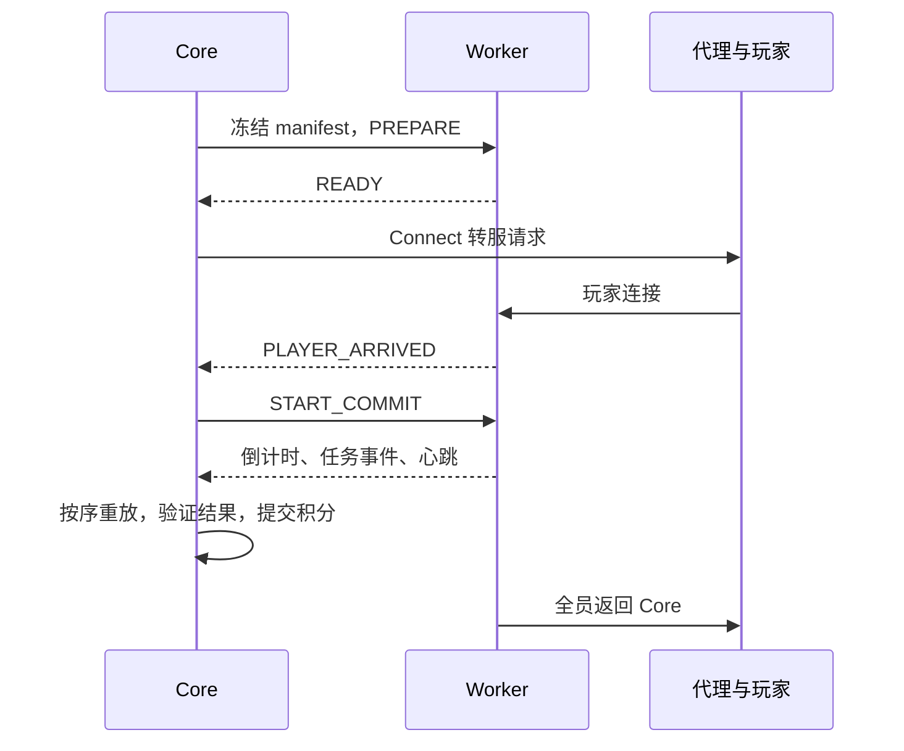

# Bingo 跨服架构

远程 Bingo 将赛程和积分控制留在 Core，将世界与实时玩法交给独立 Folia Worker。两端通过 Redis Streams 交换 manifest、命令和事件，玩家通过代理转服。

## 目录

- [模式与模块](#模式与模块)
- [权威与共享规则](#权威与共享规则)
- [生命周期与路由](#生命周期与路由)
- [Redis 与持久化](#redis-与持久化)
- [部署配置](#部署配置)
- [世界与重置](#世界与重置)
- [联调与故障验证](#联调与故障验证)

## 模式与模块

`bingo.execution-mode: LOCAL` 在 Core 内执行；`REMOTE` 使用独立 Worker。只在没有活动比赛时切换执行模式。Core 运行要求见 [主 README](../README.md)，远程环境见 [Worker README](../championships-bingo-worker/README.md)。

| 模块 | 职责 |
| --- | --- |
| `championships-common` | 协议、manifest、生命周期、确定性 ID 和展示策略 |
| `championships-bingo-engine` | 不依赖 Bukkit 的完成排序、计分、排名与结果哈希 |
| `championships-platform-bukkit` | Paper/Folia 调度、任务观察、玩家状态、世界规则、散布与共享展示 |
| `championships-redis` | Streams、consumer group、pending 接管、DLQ 与公共聊天 |
| `championships-bingo-worker` | 世界、玩家、UI、任务观察和事件回传 |
| `championships-core` | 赛程、manifest、事件重放、积分和数据库 |
| `championships-bingo-loadtest` | 隔离区块与实体压测，不参与正式比赛 |

当前 wire 协议为 8，由 `ProtocolVersion.CURRENT` 定义，其他协议版本会被拒绝。共享模块随插件打包，不单独安装。共享契约变化时从根目录构建双方：

```bash
mvn -B -ntp -pl championships-core,championships-bingo-worker -am clean package
```

## 权威与共享规则

Core 是正式积分和数据库的唯一权威，负责冻结队伍、名册、任务、规则与展示快照，独立重放 Worker 的完成观察，验证结果哈希后写入积分。Worker 不直接访问 Core 数据库。

两端共用任务判定、装备、效果、世界规则、安全散布、玩家状态和队伍展示；纯计分运行于 Bingo engine。消息、语言、任务富文本与 `scoreboards.yml` 从 Core 冻结到 manifest，Worker 不维护另一份玩法配置。

旁观服务器模式为真实 Spectator，客户端呈现由平台层统一处理。Core 与 Worker 各有实体显隐管理器，双方均保持完整 Tab；详见 [旁观契约](spectator-visibility-contract.md)。

## 生命周期与路由



状态主路径为 `CREATED → PREPARING → READY → ROUTING → COUNTDOWN → RUNNING → SETTLING → FINISHED`，非终态可进入 `ABORTED`。`matchId + epoch` 隔离旧命令、回调和事件。

manifest 保留完整名册。创建时在线选手的 `requiredAtStart` 阻塞到达屏障；没有在线选手时拒绝开局。规则介绍不提前发卡片与装备，准备完成并成功散布后进入最后倒计时。

代理使用 BungeeCord `Connect` Plugin Message。Velocity 需要开启相应兼容 channel。转服请求不等于到达；到达只由 Worker 的 `PLAYER_ARRIVED` 确认。

| 连接位置与状态 | 处理 |
| --- | --- |
| Core，Worker 尚在准备 | 等待 Worker `READY` |
| Core，比赛已就绪或运行 | 按 manifest ownership 路由到 Worker |
| Worker，玩家属于活动比赛 | 恢复角色、背包、任务基线和断线位置 |
| Worker，无 ownership 或比赛已结束 | 返回配置的 Core 服务 |

动态旁观在 Worker 确认 `SPECTATOR_ADDED` 后转服。已落地选手重连恢复断线位置，不重新散布。

## Redis 与持久化

| 键 | 用途 |
| --- | --- |
| `<namespace>:bingo:commands:<workerId>` | Worker 命令流 |
| `<namespace>:bingo:events` | 比赛事件 |
| `<namespace>:bingo:manifest:<matchId>:<epoch>` | 冻结快照 |
| `<namespace>:core:data-sync` | Core 数据缓存失效同步 |
| `<namespace>:chat:global` | 跨服公共聊天 |

传输为至少一次投递：成功处理后 `XACK`，`XAUTOCLAIM` 接管失联 pending，坏消息或超出投递次数进入 DLQ。Worker 先写磁盘 outbox，恢复 Redis 后按序重投。

Core 的 `RemoteBingoStore` 在同一事务中提交 inbox 与比赛状态，只接受连续 `eventSeq`；任务另有连续 `completionSeq`。最终 `resultHash` 一致才提交正式积分。积分使用由 match、epoch、completion、玩家 UUID 和奖励类型构成的确定性事务 ID，避免重投重复计分。

Core 数据同步广播版本化失效域，接收端从数据库重载。定期对账补偿发布中断，重启时只回收本实例的孤儿比赛。每个 Core `redis.instance-id` 必须稳定且唯一；`auto` 在数据目录持久化，克隆目录后需区分 ID。

公共聊天使用每实例独立 consumer group，同一消息投递给各实例；发送端忽略自己的回声，超过实时窗口不补发。`/teammsg` 不进入公共流。Worker ID 重复会导致共享消费进度。

## 部署配置

以下是需合并到生成文件的示例，`redis-host`、`bingo-worker` 和 `core` 分别替换为 Redis 主机和代理注册服务名。

Core `plugins/ChampionshipsCore/config.yml`：

```yaml
redis:
  enabled: true
  instance-id: auto
  uri: redis://redis-host:6379/0
  namespace: championships
bingo:
  execution-mode: REMOTE
  worker-id: bingo-1
  worker-server: bingo-worker
  proxy-channel: BungeeCord
  ready-timeout-seconds: 30
  arrival-timeout-seconds: 45
  heartbeat-timeout-seconds: 20
```

Worker `plugins/ChampionshipsBingoWorker/config.yml`：

```yaml
enabled: true
worker-id: bingo-1
redis:
  uri: redis://redis-host:6379/0
  namespace: championships
proxy:
  channel: BungeeCord
  return-server: core
worlds:
  overworld: bingo
  nether: bingo_nether
  the-end: bingo_the_end
  allow-reuse-without-reset: false
```

Worker 每 5 秒发心跳，Core 默认 20 秒无连续事件或心跳即终止并清理 ownership。超时需同时考虑区块准备、代理到达和基础设施资源；不应通过无限增加超时掩盖失联。

## 世界与重置

每个 Worker 同时承载一个比赛，主世界、下界和末地组成同一世界槽。三维度边界为以 `(0,0)` 为中心的 16000×16000 格，开局落点保留 3000 格边缘缓冲。同队共用安全点，队伍间分散；所有在线选手成功传送后才进入倒计时，找不到安全地面或传送失败则中止。

重置由 Worker 与部署方共同完成：Worker 等全员返回 Core 后写入 `.championships-bingo-reset` 并关服；外部监督进程等待 Java 退出、移走旧世界、处理标记并启动新进程。新 Worker 异步删除退役世界。本仓库不提供该监督脚本，具体格式和目录要求见 [Worker 重置接入](../championships-bingo-worker/README.md#世界重置接入)。

正式部署保持 `worlds.allow-reuse-without-reset: false`。新世界的 seed 筛选与预生成属于开局前的外部准备流程；不能假定已生成的旧世界会在重置后保留。

## 联调与故障验证

1. 先验证 Core `LOCAL`，再准备 Redis、代理与 Worker；首次生成 Worker 配置保持禁用。
2. 配置世界、唯一 ID、代理回退和外部重置流程后启用 Worker。
3. 在空闲窗口切到 `REMOTE`，用测试队伍验证准备、到达、任务、重生、结算、返回和第二局。
4. 演练 Worker/Core 重启、Redis/数据库中断、玩家重连、重复事件、代理目标不可达。
5. 核对连续事件、幂等积分、旧 epoch 隔离、outbox 恢复及所有临时实体/任务/票据清理。
6. 用 [LoadTest](../championships-bingo-loadtest/README.md) 定位区块与实体压力，再按 [容量指南](bingo-64-player-performance-report.md) 验证真实连接的完整比赛。

Folia 的并行收益依赖空间分布；单 region 热点不能仅靠增加 tick 线程解决。部署验收同时查看 region TPS/MSPT、区块加载延迟、实体分布、Redis 与数据库指标。
